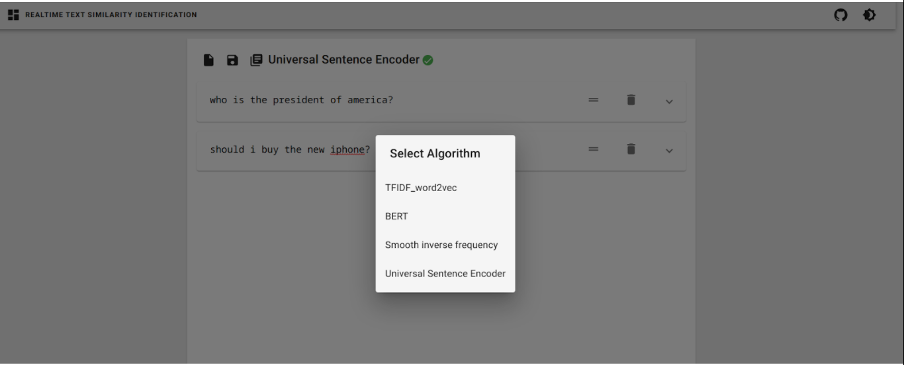
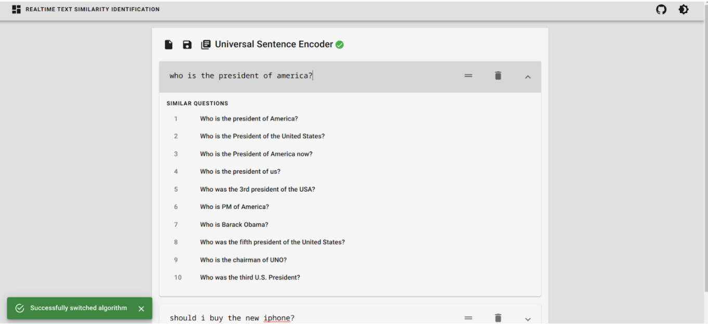
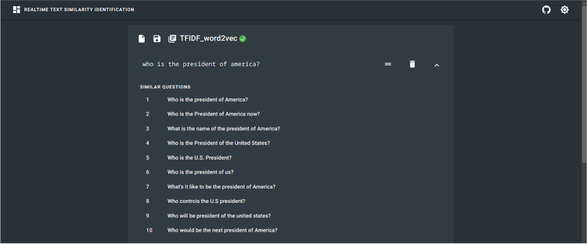
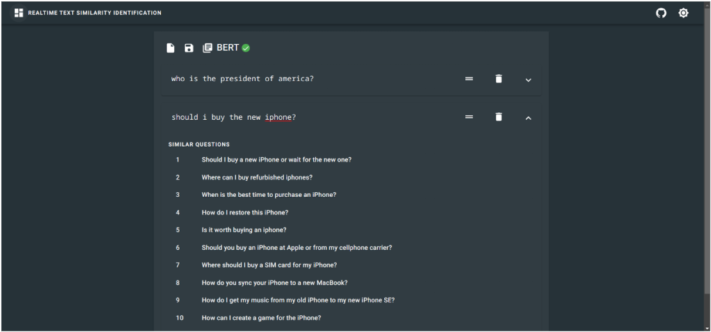

# Real Time Text Similarity Identification

This is the frontend for real time semantic simialrity search with respect to reference database. We use Appromixate Nearest Neighbour search to search for the approximate neighbours in high dimensional space. We search sentences semantically similar to query sentence by calculting the sentence embedding for the query setnence and matching it with the already calculated embeddings in the reference database. Different methods are used to calculate the sentence embeddings which include Weighted Average, Weighted Average Combined with TFIDF Score, Smooth Inverse Frequency Method, Sentence Transformers, Universal Sentence Encoders.

## Images

